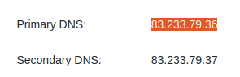
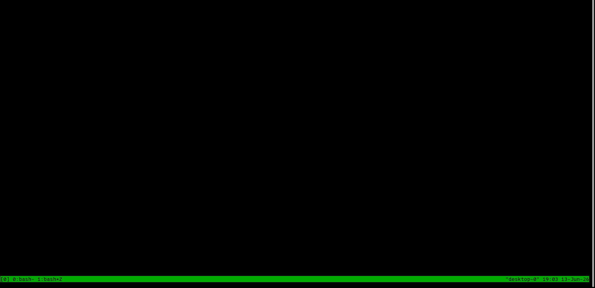

# Inledning
Detta är den första laborationsuppgiften för kursen Data Communication and Networks (DA541A HT26).

# Uppgift 1

## Fråga 1
> What are the IP address and MAC address for the active Internet connection on your computer?

Jag börjar med att läsa på om verktyget _ifconfig_. Bland tillval hittar jag flaggan '_-a_', som anger alla _interfaces_ på min maskin.

```bash
$ man ifconfig | sed -n '29,30p'
OPTIONS
       -a     display  all  interfaces  which are currently available, even if down
```
\newpage
Kör kommandot.
```bash
$ ifconfig -a
enp3s0: flags=4163<UP,BROADCAST,RUNNING,MULTICAST>  mtu 1500
        inet 192.168.0.137  netmask 255.255.255.0  broadcast 192.168.0.255
        inet6 fe80::1d71:b5cc:c9f3:b1cd  prefixlen 64  scopeid 0x20<link>
        ether 8c:89:a5:0b:57:f7  txqueuelen 1000  (Ethernet)
        RX packets 1459047  bytes 1931682277 (1.9 GB)
        RX errors 0  dropped 4093  overruns 0  frame 0
        TX packets 462847  bytes 104787548 (104.7 MB)
        TX errors 0  dropped 3 overruns 0  carrier 0  collisions 0
        device interrupt 19  

lo: flags=73<UP,LOOPBACK,RUNNING>  mtu 65536
        inet 127.0.0.1  netmask 255.0.0.0
        inet6 ::1  prefixlen 128  scopeid 0x10<host>
        loop  txqueuelen 1000  (Local Loopback)
        RX packets 29420  bytes 2958053 (2.9 MB)
        RX errors 0  dropped 0  overruns 0  frame 0
        TX packets 29420  bytes 2958053 (2.9 MB)
        TX errors 0  dropped 0 overruns 0  carrier 0  collisions 0

wlp5s0: flags=4098<BROADCAST,MULTICAST>  mtu 1500
        ether 6c:71:d9:77:2c:45  txqueuelen 1000  (Ethernet)
        RX packets 0  bytes 0 (0.0 B)
        RX errors 0  dropped 0  overruns 0  frame 0
        TX packets 0  bytes 0 (0.0 B)
        TX errors 0  dropped 0 overruns 0  carrier 0  collisions 0
```
Det översta interfacet är maskinens ethernet adapter, mellerst finns maskinens lokala adress och nederst är wifi adaptern.

Kör kommando för att hitta ethernet adapterns ipv4 och ipv6 adresser.
```bash
$ ifconfig enp3s0 | awk '/inet/ {print $1, $2}'
inet 192.168.0.137
inet6 fe80::1d71:b5cc:c9f3:b1cd
```
Och likadant för dess MAC adress.
```bash
$ ifconfig enp3s0 | awk '/ether/ {print $1, $2}'
ether 8c:89:a5:0b:57:f7
```
\newpage
## Fråga 2.1
> What is the configured DNS server IP address? 

Använder verktyget _resolvectl_.
```bash
$ resolvectl status enp3s0 | sed -n '4p'
Current DNS Server: 192.168.0.1
```
Detta pekar på min router.
Kollar in vilken DNS serveradress som min router pekar på.
{width=50%}

Kör en _whois_ på adressen.
```bash
$ (whois 83.233.79.36; whois 83.233.79.37) | awk '/netname/ {print}'
netname:        BREDBAND2-NET-SE
netname:        BREDBAND2-NET-SE
```
"_BREDBAND2_" är min ISP (Internet Service Provider).

## Fråga 2.2
> What is this DNS server used for?

DNS (Domain Name System) översätter läsbara domännamn (ex: '_https://www.google.com_') till ip adresser (216.58.201.206) som används för att kontakta servern.

\newpage

# Uppgift 2
## Fråga 3.1
> What is the DNS server IP address used for this name resolution?
```bash
$ nslookup www.mit.edu | awk '/Server/ {print}'
Server:		127.0.0.53
```
Detta är min ubuntu maskins lokala DNS server.

## Fråga 3.2
> What are the IP addresses for the host '_www.MIT.edu_'?
```bash
$ nslookup www.mit.edu | sed -n '4,$p'
Non-authoritative answer:
www.mit.edu	canonical name = www.mit.edu.edgekey.net.
www.mit.edu.edgekey.net	canonical name = e9566.dscb.akamaiedge.net.
Name:	e9566.dscb.akamaiedge.net
Address: 88.221.97.35
Name:	e9566.dscb.akamaiedge.net
Address: 2a02:26f0:9500:1398::255e
Name:	e9566.dscb.akamaiedge.net
Address: 2a02:26f0:9500:1399::255e
```
- IPv4 Adress: 88.221.97.35

- IPv6 Adress: 2a02:26f0:9500:1398::255e

- IPv6 Adress: 2a02:26f0:9500:1399::255e


## Fråga 3.3
> Is '_www.mit.edu_' an alias? 

Ja.
```bash
$ nslookup www.mit.edu | awk '/canonical/ {print}' | sed -n '1p'
www.mit.edu	canonical name = www.mit.edu.edgekey.net.
```
Och även '_www.mit.edu.edgekey.net_' är ett alias, eftersom...
```bash
$ nslookup www.mit.edu | awk '/canonical/ {print}' | sed -n '2p'
www.mit.edu.edgekey.net	canonical name = e9566.dscb.akamaiedge.net.
```

\newpage

## Fråga 4.1 
> What are the DNS servers responsible for domain names in mit.edu?
```bash
$ nslookup -type=NS mimt.edu | sed -n '5,13p | sort'
mit.edu	nameserver = asia1.akam.net.
mit.edu	nameserver = asia2.akam.net.
mit.edu	nameserver = eur5.akam.net.
mit.edu	nameserver = ns1-173.akam.net.
mit.edu	nameserver = ns1-37.akam.net.
mit.edu	nameserver = use2.akam.net.
mit.edu	nameserver = use5.akam.net.
mit.edu	nameserver = usw2.akam.net.
```

## Fråga 4.2
> Find out these DNS server IP addresses (by using nslookup respectively on the name servers found in A).
```bash
$ nslookup asia1.akam.net | sed -n '4,$p' | awk '/Address:/ {print}'
Address: 95.100.175.64

$ nslookup asia2.akam.net | sed -n '4,$p' | awk '/Address:/ {print}'
Address: 95.101.36.64

$ nslookup eur5.akam.net | sed -n '4,$p' | awk '/Address:/ {print}'
Address: 23.74.25.64

$ nslookup ns1-173.akam.net | sed -n '4,$p' | awk '/Address:/ {print}'
Address: 193.108.91.173
Address: 2600:1401:2::ad

$ nslookup ns1-37.akam.net | sed -n '4,$p' | awk '/Address:/ {print}'
Address: 193.108.91.37
Address: 2600:1401:2::25

$ nslookup use2.akam.net | sed -n '4,$p' | awk '/Address:/ {print}'
Address: 96.7.49.64

$ nslookup use5.akam.net | sed -n '4,$p' | awk '/Address:/ {print}'
Address: 2.16.40.64
Address: 2600:1403:a::40

$ nslookup usw2.akam.net | sed -n '4,$p' | awk '/Address:/ {print}'
Address: 184.26.161.64
```

## Fråga 5.1
> Which DNS server is used for this name resolution?

DNS servern som används har adress '_8.8.8.8_'.
```bash
$ nslookup www.hkr.se 8.8.8.8
Server:		8.8.8.8
Address:	8.8.8.8#53

Non-authoritative answer:
Name:	www.hkr.se
Address: 194.47.45.20
```
Servern administreras av Google.
```bash
$ whois 8.8.8.8 | awk '/OrgName/ {print}'
OrgName:        Google LLC
```
## Fråga 5.2
> Do you find the IPv6 address for '_https://www.hkr.se/_'?
Finns ingen publicerad IPv6 adress för '_https://www.hkr.se/_' så vidt jag kan se.

# Uppgift 3


# Punktlista
- Recusandae similique unde impedit impedit magni nisi assumenda.
- Officia laudantium omnis velit earum.
- Vel repellendus dolorem blanditiis aut quaerat aut rem excepturi.

# Paragraf
Eveniet odit voluptatem ea. Voluptatem fugit voluptatem est corrupti doloremque aut. Officia quam consectetur repellat suscipit quos alias. Beatae labore corrupti voluptatem cumque qui quas labore. Numquam eos esse qui qui laborum quisquam non voluptatem. Et dolorem officiis qui.  

Dolorem aperiam nihil in voluptate quidem nihil aliquam. Quasi vero cupiditate iusto id laborum iure. Nam reprehenderit illo nostrum quam pariatur harum natus qui. Error aut et voluptas et ea officiis ut. Distinctio ea qui impedit ut totam laboriosam labore.

\newpage
# Tabell
+---+---+---+
| a | b | c |
+---+---+---+
| a0| b0| c0|
+---+---+---+
| a1| b1| c1|
+---+---+---+
| a2| b2| c2|
+---+---+---+

# Kodblock
```{.python .numberLines startFrom="6"}
print("Hello World!")
```

# Bild


